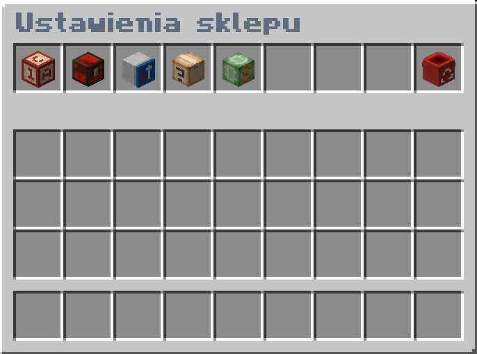
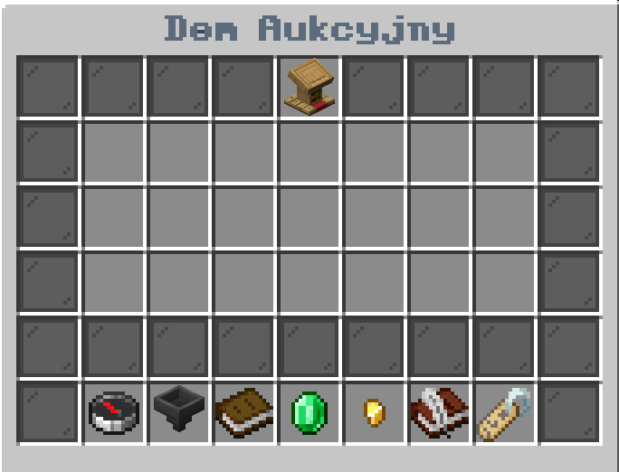

# Ekonomia
Na naszym serwerze znajdziesz rozwinięty i unikatowy plugin na ekonomię oparty na fizycznych dukatach. Wartość jednego dukata jest bardzo wysoka - tak jak w prawdziwym średniowieczu, dla przykładu jeden dukat warty jest 64 sztuki kamienia, czy 8 sztuk żelaza. 
Dukaty poza formą fizyczną można przechowywać w banku. Aby to zrobić należy udać się na spawn i znaleźć bankiera, który bez problemu wpłaci lub wypłaci wam pieniądze. Korzystanie z usług bankiera jest całkowicie darmowe.

## Jak zarabiać pieniądze?
- Aby zarobić pierwsze pieniądze udaj się na spawn komendą **/spawn** i sprzedaj posiadane przez Ciebie przedmioty u różnych wieśniaków,
- Wystawiaj przedmioty na sprzedaż w swoim sklepie używając komendy **/sklep stworz**,
- Umawiaj się i handluj z innymi graczami,
- Przejmuj majątki innych graczy podczas wojen,
- Wyznaczaj reparacje wojenne po wygranych wojnach.

:::info Informacja
Ekonomia zbalansowana jest tak, że gracze muszą ze sobą handlować. Wynika to z faktu braku możliwości kupywania surowców na spawnie oraz specjalnie zbalansowanych surowców.
:::

## Pytania dotyczące sklepów

### Jak zrobić własny sklep?
Aby zrobić własny sklep postaw skrzynkę, wybierz na dolnym pasku przedmiot jaki chcesz sprzedawać (w późniejszej fazie będziesz mógł dodawać kolejne), a następnie patrząc się na postawioną skrzynkę wpisz komendę **/sklep stworz**. Po wpisaniu tej komendy przytrzymaj shift i naciśnij PPM na sklep aby go skonfigurować. 
W celu zrobienia własnego targowiska możesz zbudować port, do którego gracze będą bez problemu mogli się szybko przemieszczać.
 

### Jak dokładać/wyjmować przedmioty ze sklepu?
Aby dokładać/wyjmować przedmioty ze sklepu naciśnij na niego **PPM**.

### Jak zarządzać pieniędzmi sklepów?
Każdy sklep postawiony przez danego gracza ma wspólny **bank**, aby wpłacić lub wypłacić z niego pieniądze użyj komendy **/sklep bank**. Dzięki tej funkcji możesz łatwo ustawić limit itemów, które chcesz kupić od innych graczy.

### Jak szybko przeglądać wszystkie sklepy?
Aby przeglądać wszystkie sklepy graczy znajdujące się na serwerze użyj komendy **/sklep lista**. Komenda ta wyświetli wszystkie sklepy bez konieczności monotomnego szukania ich po mapie.

### Jak kupić wybrany przedmiot u dowolnego gracza?
Aby znaleźć sklepy sprzedające interesujący nas przedmiot należy użyć komendy **/sklep szukaj `[nazwa_przedmiotu]`**. Po użyciu tej komendy gra wyświetli GUI zawierające wszystkie interesujące nas sklepy.

### Jak kupować od wybranego gracza?
Aby znaleźć sklepy wystawione przez wybranego gracza należy użyć komendy **/sklep zobacz `[nazwa_gracza]`**. Komenda ta wyświetli wszystkie sklepy stworzone przez wybranego gracza, co pozwoli na kupno przedmiotów w jego sklepach.

### Jak usunąć sklep?
Aby usunąć sklep, musisz patrzeć na skrzynkę, która jest magazynem sklepu, który chcesz usunąć. Następnie wejdź w menu sklepu używając shifta i PPM i wybierz opcję Usuń sklep. Alternatywnym rozwiązaniem jest wpisanie komendy **/sklep usun**

### Inne pytania dotyczące sklepów
Aby otrzymać odpowiedzi na wszystkie inne pytania dotyczące sklepów, udaj się na nasz serwer Discord i stwórz Ticket na kanale #tickety. Jeżeli nie wiesz jak to zrobić możesz zadać swoje pytanie na chacie głównym, bądź w wiadomości prywatnej do dowolnego członka moderacji.

## Aukcje
Na naszym serwerze znajdziecie system aukcji w postaci otwartego dla graczy sklepu. Sklep ten znajdziecie na spawnie pod nazwą Dom Aukcyjny. Przedmioty na aukcje można wystawiać w każdej chwili używając komendy **/aukcjasprzedaj `[cena]`**, przy czym minimalna cena wynosi 10 dukatów. Aukcje mają na celu wprowadzić możliwość handlowania bardziej cennymi przedmiotami, lub prowincjami. W menu aukcji nie można podbijać ceny, da się jedynie wystawiać lub kupować przedmioty. Wystawione na aukcję przedmioty są możliwe do kupienia przez okres 8 dni. Po tym czasie albo przedmiot zostanie kupiony albo zwrócony właścicielowi.

## Dlaczego dukaty w formie fizycznej?
Ekonomia opiera się na dukatach w formie fizycznej w celu dodania immersji. Takie rozwiązanie pozwala między innymi na większe zdobycze podczas wojen oraz na napadanie na innych graczy podczas ich podróży po mapie. Ekonomia w takiej formie jest całkowicie autorska, przez co nasz serwer znacznie wyróżnia się na tle innych. Przy takim rozwiązaniu wszystkie transakcje dokonywane są przy użyciu fizycznych dukatów, co dodatkowo buduje średniowieczny klimat serwera.

## Jakie sklepy znajdują się na spawnie?
Na spawnie znajduje się wiele różnych sklepów. Każdy sklep pozwala na sprzedaż przedmiotów z danej kategorii. 
W sumie na spawnie znajduje się 8 sklepów:
- Sklep blokarzowej,
- Sklep żywnościowy,
- Sklep górniczy,
- Sklep roślinny,
- Sklep drwala,
- Sklep z wełną,
- Sklep łowcy,
- Sklep inżyniera.

:::info Informacja
Jeżeli nie możesz znaleźć danego sklepu, postaraj się znaleźć znaki lub tabliczki, które mogą do niego prowadzić.
:::

