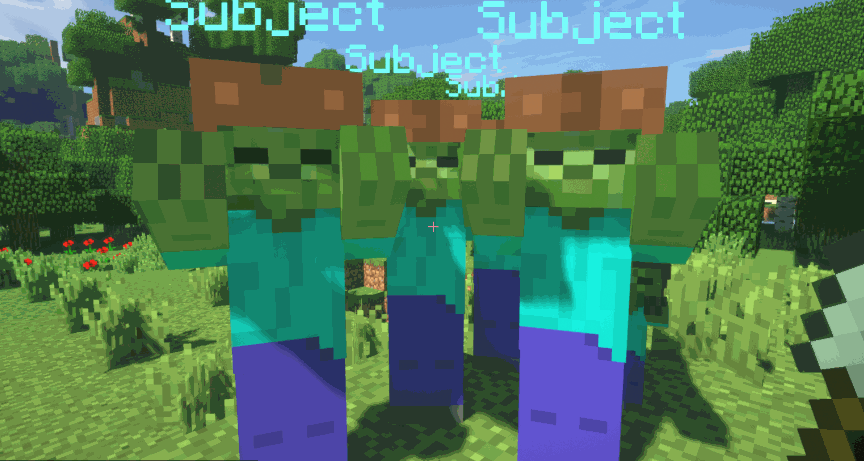

Na serwerze znajduje się w sumie 80 tarcz, 50 hełmów, ok. 50 różnorodnych broni oraz wiele zbroi.
### Typy broni
Bronie dzielą się na następujące typy:
- Obuchowe (Np. Maczugi)
- Cięte (Zakrzywione miecze, miecze dwuręczne) 
- Przebijające (Piki, włócznie, lance)
### Typy obrażeń

Obuchowe zadają obrażenia obszarowe wookół celu.

Cięte zadają obrażenia w stożku.

Przebijające zadają obrażenia za celem.

### Rodzaje zbroi
- Skórzane:
Jest to najsłabszy rodzaj zbroi, lecz ta jest znacznie lżejsza dzięki czemu szybciej się poruszasz.
- Kolczugowe:
Jest to podstawowy rodzaj zbroi, jest cięższa od skórzanej dzięki czemu wolniej się poruszasz, lecz zapewnia większą ochronę.
- Płytowe:
Jest to najlepszy rodzaj zbroi, najcięższa zbroja, co sprawia najwolniejsze poruszanie się, lecz zapewnia największą ochronę.

### Crafting
Aby zobaczyć receptury na bronie, zbroje, hełmy użyj komendy /receptury.

### Bronie rzucane soon™
Na serwerze znajdują się bronie rzucane np. javelin, aby rzucać należy włączyć tryb rzucania kucając i kilkając PPM, a następnie rzucić LPM.

credit: mvndicraft
