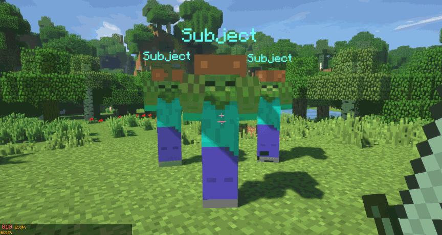
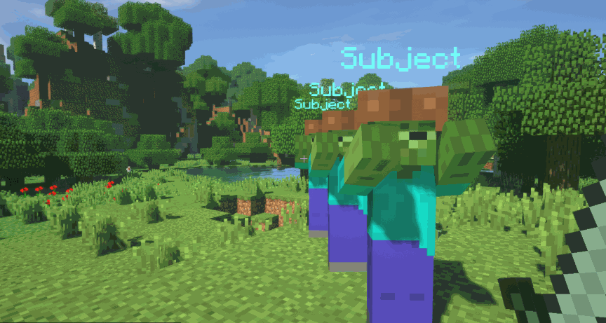

Na serwerze znajduje się w sumie 80 tarcz, 50 hełmów, ok. 50 różnorodnych broni oraz wiele zbroi.
### Typy broni
Bronie dzielą się na następujące typy:
- Obuchowe (Np. Maczugi lub ciężkie topory)
- Cięte (Zakrzywione miecze, miecze dwuręczne) 
- Przebijające (Piki, włócznie, lance)
### Typy obrażeń

Obuchowe zadają obrażenia obszarowe wookół celu.

Cięte zadają obrażenia w stożku.

Przebijające zadają obrażenia za celem.

### Crafting
Aby zobaczyć receptury na bronie, zbroje, hełmy użyj komendy /receptury.

### Bronie rzucane soon™
Na serwerze znajdują się bronie rzucane np. javelin, aby rzucać należy włączyć tryb rzucania kucając i kilkając PPM, a następnie rzucić LPM.

credit: mvndicraft
