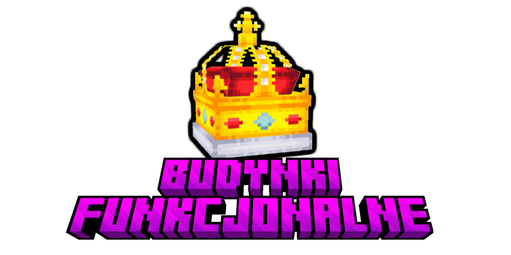

# Budynki Funkcjonalne
Jak dobrze wiecie, nowa edycja będzie odbywać się w czasach średniowiecznych, w związku z tym narzucony będzie średniowieczny styl budowania. Żadne kary za niewłaściwy styl budynku typu ban lub zniszczenie budowli nie będą stosowane przez administrację, jednak zachowanie immersji budowli jest bardzo mile widziane i bardzo opłacalne dla graczy.

By urozmaicić chęć budowania, dodano **budynki funkcjonalne**! Wyróżniamy: miasto, kuźnię, zbrojownię, farmę, port oraz rafinerię. Na czym one polegają?

## Tiery miast
Jeżeli zbudujesz ładny, średniowieczny budynek w prowincji, otrzymasz bardzo fajne i korzystne bonusy na jej terenie! W zależności od jakości i wyglądu budynku, twoja prowincja dostanie bonus w zależności od **tieru miasta**.

:::info Informacja
Budynki funkcjonalne podlegają ocenie administracji - dokładniej osobom z rangą Minecraft Staff, zatem trzeba się postarać aby zdobyć wysokie bonusy do surowców. Wszystkie budynki funkcjonalne mają 3 tiery, wyższe tiery są trudniejsze do zdobycia, jednak zapewniaja dużo większe bonusy. Jako administracja nie spodziewamy się wielu miast na Tierze 3, jednak liczymy na waszą kreatywność!
:::

### Tier 1
- +50% Boost do przychodu z prowincji

### Tier 2
- +100% Boost do przychodu z prowincji
- +30% Boost do dropu z kamienia na danej prowincji

### Tier 3
- +300% Boost do przychodu z prowincji
- +100% Boost do dropu z kamienia na danej prowincji

## Rafinerie
Różne itemy np. ciężka stal potrzebują **rafinerii** do ich wytworzenia, którą trzeba oczywiście zbudować, jeżeli tego nie zrobisz będziesz musiał kupywać zasób od innych prowincji.
Każdy typ **rafinerii** ma, podobnie jak miasto, 3 tiery. Tiery **rafinerii** przypisywane będą przez administrację. Tutaj jednak każdy kolejny tier zamiast dawać więcej surowców, przyspiesza jedynie produkcję. 
Każda prowincja może mieć po jednej **rafinerii** każdego typu. 

### Kuźnia
W kuźni po połączeniu 64 sztuk żelaza, 16 sztuk węgla i 16 sztuk stali otrzymasz jedną, lecz bardzo cenną sztabkę **ciężkiej stali**.

### Labolatorium
W Labolatorium po połączeniu 64 sztuk redstone`a oraz 2 łez ghasta otrzymasz 16 sztuk **Blaze Powdera**, który przyda się w tworzeniu wszelakich mikstur.

- Aby zobaczyć ekwipunek rafinerii użyj **/refinery**, stojąc na prowincji, gdzie jest rafineria. $$$$$$$$$$$$
- Gdy minie czas rafineria przetworzy zasoby na **/t income** $$$$$$$$$$$$$

:::info Informacja
Czas przetwarzania rafinerii pierwszego tieru wynosi 30 minut, tieru drugiego 15 minut, a tieru trzeciego jedynie 3 minuty!
:::

## Porty
Port jest jedynym sposobem na szybką podróż po gigantycznej mapie naszego serwera, poza tym pełni on funkcję budowanej przez gracza osady handlowej.
Porty budowane być mogą jedynie w prowincjach mających dostęp do morza lub oceanu. 
Porty, tak jak inne budynki funkcjonalne budowane być muszą w stylu średniowiecznym.

:::info Informacja
Domyślnie szybka podróż w porcie jest darmowa i odbywa się poprzez użycie komendy **/port warp `nazwa_portu`**, jednak właściciel portu może ustawić cenę podróży do niego poprzez użycie komendy **/port fee**
:::
