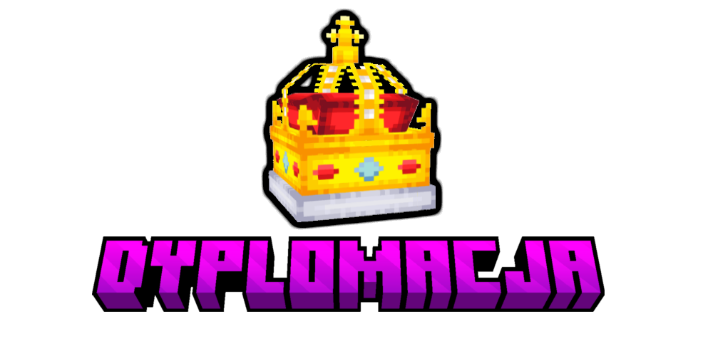

### Sojusze
- Użyj **/sojusz `nazwa_miasta/nazwa_panstwa`** aby wysłać, bądź zaakceptować ofertę **sojuszu**.
- Miasta lub państwa w sojuszu nie mogą sobie wypowiadać wojen.
- Wypowiedzenie wojny innemu państwu/miastu spoza sojuszu **nie** oznacza wciągnięcia sojuszników do wojny!
- Użyj **/rozwiazsojusz `nazwa_miasta/nazwa_panstwa`** aby rozwiązać sojusz z danym państwem/miastem.
	- Po rozwiązaniu sojuszu miasta wchodzą w okres 48-o godzinnego **rozejmu**, podczas którego państwa te nie mogą wypowiedzieć sobie wojny.

:::info Informacja
Miasta mogą tworzyć sojusze bez państwa. Kiedy miasto dołącza do państwa, wszystkie poprzednie sojusze się usuwają. Kiedy miasto wychodzi z państwa, jego sojusze też zostają usunięte. Kiedy państwo zostanie usunięte, wszystkie sojusze miast się usuwają.
:::

### Wojny
- Podczas wojny miasta mogą zajmować i okupować, bądź anektować prowincje innych miast.
- Aby wypowiedzieć wojnę należy użyć komendy **/wojna `nazwa_miasta/nazwa_panstwa`**. Jeżeli twój przeciwnik jest w państwie, wszystkie miasta z państwa wezmą udział w wojnie.
- Miasta mogą zakończyć wojnę traktatem pokojowym. Po takowym traktacie miasta wchodzą w stan **rozejmu**, podczas którego przez 48 godzin nie mogą wypowiedzieć sobie wojny. Dzięki temu pokonane państwo będzie miało czas na rozbudowe i kontratak, o ile nie zostało ono całkowicie zajęte w ramach owego traktatu.
- W odróżnieniu od czasu pokoju, w czasie wojen włączone są **eksplozje**!

:::caution Uwaga!
Nie możesz wypowiadać wojny państwu/miastu, które nie ma graczy online. W celu uniknięcia sytuacji, w których jeden kraj wypowiada wojnę drugiemu z jedną osobą online, wojny włączone są codziennie w godzinach 17:00 - 20:00.
:::

### Atakowanie prowincji
Aby zaatakować prowincje stawiamy dowolny **płotek** na chunku (płotek ma imitować "flagę"). 
- Atakowany chunk musi graniczyć z twoją prowincją, bądź z innym przejętym chunkiem.
- Możliwe jest atakowanie trzech różnych chunków w tym samym czasie.
- "Flaga" musi widzieć niebo, nie może być postawiona pod ziemią lub pod wodą.
- Zniszcz wełnę lub płotek by przerwać atak przeciwnika (po postawieniu **płotka**, plugin automatycznie kładzie na niego wełnę).
- Jeżeli "flaga" nie zostanie znisczona, po upływie 45 sekund zajmiesz chunk'a. Możesz obudować "flagę", jednak nie możesz postawić bloku w obrębie jednej kratki od "flagi".
- Zajmij Home chunk (**H** na /miasto minimapa lub /miasto mapa) aby zająć całą prowincję, tym samym ją okupując. Pamiętaj jednak, że zajmowanie Home chunka trwa prawie pięć minut!

    

:::tip Porada
Warto użyć minimapy **/miasto minimapa**, by widzieć na jakim chunku się znajdujesz oraz jakie chunk/chunki możesz zaatakować.
:::

### Okupacja prowincji
- Każda prowincja ma swój **home chunk** oznaczona literą "H" na /miasto minimapa lub /miasto mapa.
- Po przejęciu home chunk'a, cała prowincja jest **okupowana** przez atakujące miasto.
- Okupant prowincji dostaje **podatki** od przegranego miasta.

:::info Informacja
Podatki to część przychodu: wykopanych rud, wydobytych plonów lub rozmnożonych zwierząt w prowincji, wszystko to idzie do okupanta. Podatki są depozytowane do skrzynki **/miasto przychod**. Podatki wynoszą 40% podstawowego zysku prowincji.
:::
:::caution Uwaga!
Okupowane prowincje nie są częścią miasta okupanta. Na okupowanych prowincjach obie strony mogą niszczyć i stawiać bloki lub otwierać skrzynki.
:::

### Aneksja
Aneksja jest mocno zalecana.
- Miasto okupujące prowincję może ją zaanektować poprzez komendę **/miasto aneksja**, jednak może to zrobić jedynie w czasie wojny.
- Anektowanie dodaje prowincje do twojego miasta, jako normalną zajętą prowincje.
- Anektowane terytorium nie kosztuje powera.

Anektowana prowincja działa jak każda inna zajęta prowincja przez twoje miasto, tzn. możesz na niej budować, używać skrzynek, itd...

### Traktaty pokojowe
- Wpisz **/pokoj `nazwa_miasta/nazwa_panstwa`** aby negocjować **traktat pokojowy**, otwiera to GUI traktatu pokojowego.
- Traktat pokojowy może być negocjowany w każdym czasie, nawet przed wojną, lub po jej zakończeniu. W ramach komendy **/pokoj `nazwa_miasta/nazwa_panstwa`** możesz np. sprzedawać prowincje innym graczom.
- Po podpisanym traktacie pokojowym, miasta wchodzą w okres rozejmu na 48h.
	- Państwa w rozejmie nie mogą wypowiadać sobie wojen.
	- Wpisz **/rozejm** aby zobaczyć trwające rozejmy z innymi miastami.

	

