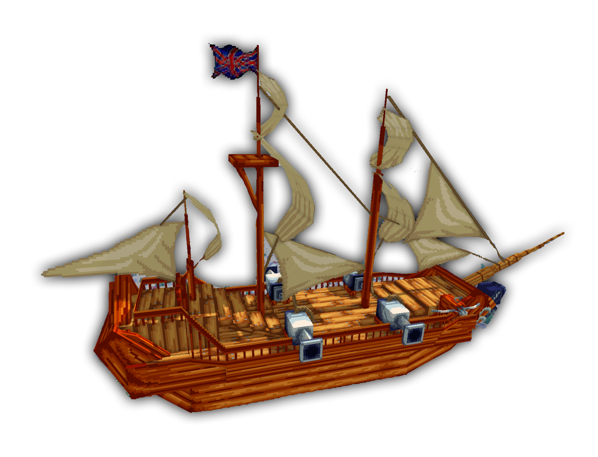

Fregata to statek bojowy, zawiera 4 działa na które mogą wsiadać gracze, zatem mieści w sumie 5 osób wraz ze sterującym.

## Jak działa Fregata?

### Jak zdobyć Fregatę?
- Udaj się na spawna, i udaj się do Inżyniera, tam zdobędziesz **projekt statku**, który pozwala na postawianie statku o ile masz wymagane materiały. **Ten kto postawi statek jest sterującym.** Natomiast kule armatnie są w recepturach.
### Jak sterować Fregatą?
Po postawieniu Fregaty otrzymujemy trzy przyciski do ekwipnku. Lewym przyciskiem zmieniamy kierunki/specjalności/przyśpieszenia, a prawym przyciskiem je aktywujemy.
- Specjalny kontroler fregaty
	- Zmień prędkość: Odpowiada za zmiane prędkości.
	- Harpun: Odpowiada za wystrzelenie harpunu.
	- Zatrzymaj: Odpowiada za zatrzymanie statku.
- Konroler kierunku Fregaty
	- Lewo/Prawo/Przód
- Przyśpieszenie